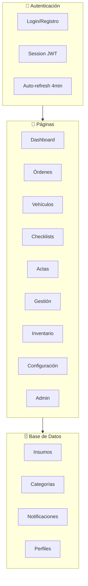
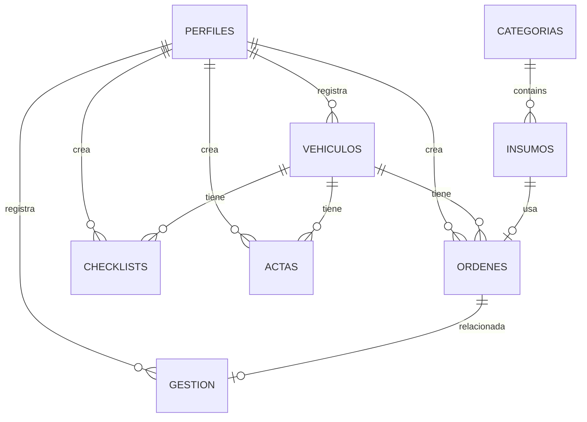
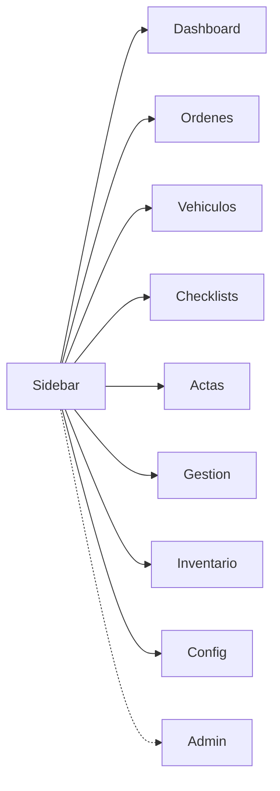

# QA - Estructura de la App

## Diagrama General

---

## Esquema de Base de datos

---

## Navegación

---

## Funcionalidades por Página

### Dashboard
| Feature | Descripción | QA Test |
|---------|-------------|---------|
| KPIs | Ventas, Costos, Margen, Órdenes | Verificar cálculos |
| Filtros | Mes, Trimestre, Año, Todo | Verificar filtrado |
| Gráficos | Barras, Doughnut, Pie | Renderizado |

### Órdenes
| Feature | Descripción | QA Test |
|---------|-------------|---------|
| CRUD | Crear, Leer, Actualizar, Eliminar | Todas las operaciones |
| Plantillas | 12 trabajos predefinidos | Selección múltiple |
| Búsqueda | Por patente, cliente | Autocompletado con ENTER |
| Export | toCSV | Descarga correcta |
| Impresión | Formato limpio | Todo en 1 página |

### Vehículos
| Feature | Descripción | QA Test |
|---------|-------------|---------|
| CRUD | Crear, Leer, Actualizar, Eliminar | Validar RUT |
| Historial | Órdenes anteriores | Cálculo total gastado |

### Checklists
| Feature | Descripción | QA Test |
|---------|-------------|---------|
| CRUD | Checklists por vehículo | Búsqueda con ENTER |
| Fotos | Imágenes del vehículo | Preview |
| Impresión | 2 columnas | Todo en 1 página |

### Actas
| Feature | Descripción | QA Test |
|---------|-------------|---------|
| CRUD | Acta por checklist | Vinculación correcta |
| Impresión | Formato formal | Firmas |

### Gestión
| Feature | Descripción | QA Test |
|---------|-------------|---------|
| CRUD | Ingresos/Egresos | Categorías |
| Export | toCSV | Fechas correctas |

### Inventario
| Feature | Descripción | QA Test |
|---------|-------------|---------|
| CRUD | Insumos | Stock |
| Import | fromCSV | Validación |
| Export | toCSV | Formato correcto |

### Configuración
| Feature | Descripción | QA Test |
|---------|-------------|---------|
| Perfil | Editar nombre | Persistencia |
| Tema | Light/Dark | Persistencia |
| Notificaciones | Ver/Editar | Toggle |

### Admin (solo admin)
| Feature | Descripción | QA Test |
|---------|-------------|---------|
| Usuarios | CRUD de usuarios | Roles |
| Respaldo | Export JSON | Integridad |
| RLS | Verificar políticas | Permisos |

---

## Casos de Prueba QA

### Auth
- [ ] Registro nuevo usuario
- [ ] Login con credenciales válidas
- [ ] Login con credenciales inválidas
- [ ] Logout
- [ ] Auto-refresh sesión (4 min)
- [ ] Restaurar sesión

### Órdenes
- [ ] Crear orden con todos los campos
- [ ] Editar orden existente
- [ ] Eliminar orden (soft delete)
- [ ] Buscar por patente
- [ ] Buscar por cliente
- [ ] Seleccionar plantillas
- [ ] Exportar a CSV
- [ ] Imprimir orden

### Vehículos
- [ ] Crear vehículo (RUT válido)
- [ ] Crear vehículo (RUT inválido)
- [ ] Editar vehículo
- [ ] Ver historial
- [ ] Total gastado correcto

### Checklists
- [ ] Crear checklist
- [ ] Editar checklist
- [ ] Buscar por patente
- [ ] Subir fotos
- [ ] Imprimir checklist (2 columnas)

### Actas
- [ ] Crear acta desde checklist
- [ ] Editar acta
- [ ] Imprimir acta

### Gestión
- [ ] Registrar ingreso
- [ ] Registrar egreso
- [ ] Filtrar por fecha
- [ ] Exportar a CSV

### Inventario
- [ ] Agregar insumo
- [ ] Editar insumo
- [ ] Importar desde CSV
- [ ] Exportar a CSV
- [ ] Alerta stock bajo

### Admin
- [ ] Crear usuario
- [ ] Cambiar rol
- [ ] Desactivar usuario
- [ ] Exportar respaldo

---

## URLs de Pruebas

| Ambiente | URL |
|----------|-----|
| Local | `http://localhost:3000` |
| Production | `https://proyecto-eao-evigueras-projects.vercel.app` |
| Tests | `https://proyecto-eao-evigueras-projects.vercel.app/test` |

---

## Credenciales de Prueba

| Rol | Email | Password |
|----|-------|----------|
| Admin | (crear nuevo) | (configurar en Supabase) |
| Lector | (crear nuevo) | (configurar en Supabase) |

---

## Bugs Conocidos a Verificar

1. ~~Editar vehículo retornaba datos incorrectos~~ - FIXED
2. ~~JWT expired~~ - FIXED con auto-refresh
3. ~~Vercel Deployment Protection~~ - FIXED (desactivado)
4. ~~Dashboard filtraba por fecha incorrecta~~ - FIXED (fecha_recepcion)

---

*Actualizado: 2026-04-24*